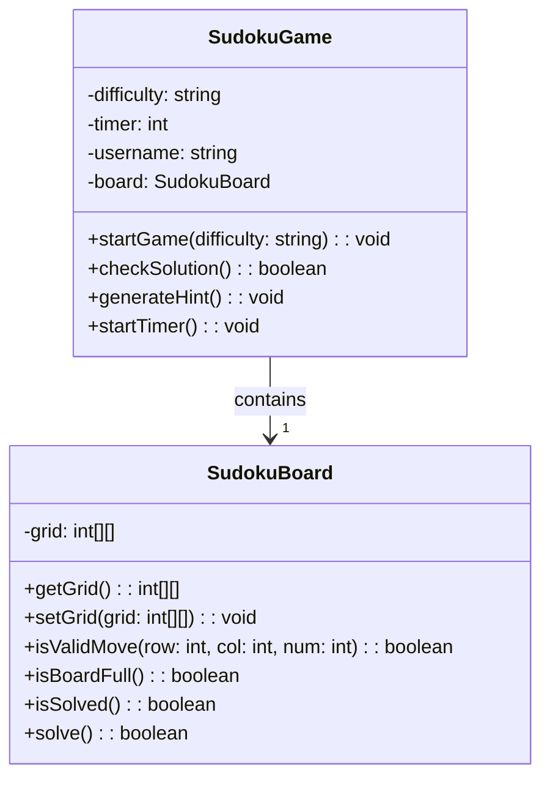

```mermaid
classDiagram
    SudokuGame --> "1" SudokuBoard : contains
    class SudokuGame {
        -difficulty: string
        -timer: int
        -username: string
        -board: SudokuBoard
        +startGame(difficulty: string): void
        +checkSolution(): boolean
        +generateHint(): void
        +startTimer(): void
    }
    class SudokuBoard {
        -grid: int[][]
        +getGrid(): int[][]
        +setGrid(grid: int[][]): void
        +isValidMove(row: int, col: int, num: int): boolean
        +isBoardFull(): boolean
        +isSolved(): boolean
        +solve(): boolean
    }
```

